# 画里画外 Beyond Canvas

[](LICENSE)
[](pyproject.toml)
[](#在-dgx-spark-上部署)
[](skills/)

**一个由老师操作的儿童美术工作室：先听孩子把画讲出来，再让画里的东西动起来、立起来、装订成书。**

第三届 NVIDIA DGX Spark 黑客松（Agent Skills 挑战赛）参赛作品。整个作品由
13 个 Agent Skills 和一个调度它们的小型 Python Harness 组成；课堂和需要 Blender 的大殿重建都运行在 NVIDIA
DGX Spark 上，开发机（Mac）只用来写代码。

## 视频介绍

点击图片在 B 站观看。

<table>
  <tr>
    <td align="center" width="33%">
      <a href="https://www.bilibili.com/video/BV1qEa36rEJ6/">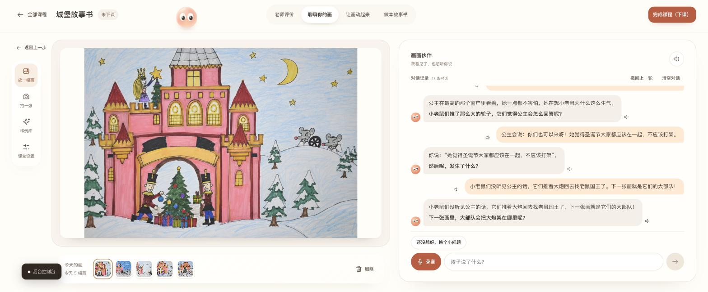</a><br>
      <b>▶ 介绍（温馨版）</b><br>项目介绍
    </td>
    <td align="center" width="33%">
      <a href="https://www.bilibili.com/video/BV1eYaL6mE5k/">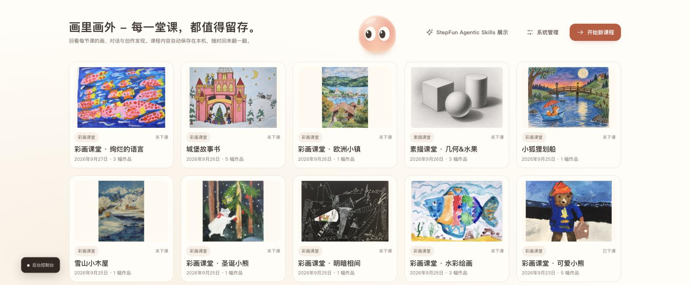</a><br>
      <b>▶ 功能快速预览</b><br>主要功能一览
    </td>
    <td align="center" width="33%">
      <a href="https://www.bilibili.com/video/BV1SdaG6NEUU/">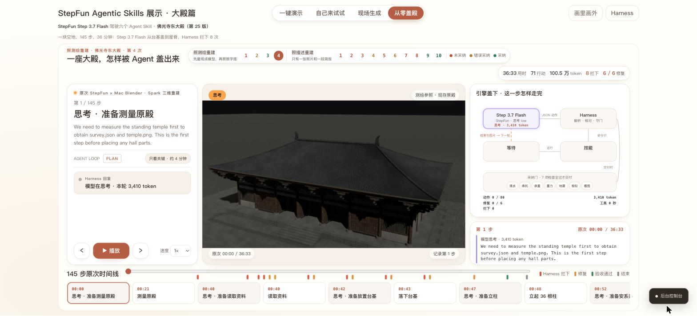</a><br>
      <b>▶ 佛光寺东大殿</b><br>StepFun Agentic Skills · 大殿篇
    </td>
  </tr>
</table>

## 目录

- [视频介绍](#视频介绍) · [项目简介](#项目简介) · [功能一览](#功能一览) · [界面一览](#界面一览) · [快速开始](#快速开始) · [在 DGX Spark 上部署](#在-dgx-spark-上部署)
- [设计思路](#设计思路) · [部署分工](#部署分工) · [多智能体协同与模型编排](#多智能体协同与模型编排) · [模型优化深度](#模型优化深度)
- [Agent Skills 设计](#agent-skills-设计) · [技术栈](#技术栈) · [测试](#测试) · [项目结构](#项目结构) · [文档索引](#文档索引)
- [数据与隐私](#数据与隐私) · [参与贡献](#参与贡献) · [许可证](#许可证) · [第三方组件与素材](#第三方组件与素材) · [致谢](#致谢)

## 项目简介

画里画外 Beyond Canvas 是一个由老师操作的儿童美术工作室。老师拍下孩子的一幅画，工作室先确认这是一幅可以回应的
孩子的画，再写出两到四句温暖、具体的反馈，外加一个请老师转问孩子的问题；随后用这幅画做出东西：一段几秒钟的动画、
一个可以调光的 3D 形体、一个可以转动的 3D 小玩偶，以及一本由原画和孩子亲口确认的话组成、用孩子自己的声音朗读的
故事书。课程档案（Portfolio）是首页，课程在下课和重启之后都还在。十四条教学规则写在评测里，保证反馈不会伤害孩子的
积极性；在彩画入口，任何“纠正”都不允许出现。

整个作品由 13 个 Agent Skills 组成，全部采用 NVIDIA 的发布格式（SKILL.md、skill card、评测用例与签名，每个都附有
BENCHMARK），由一个小型 Python Harness 调度。教室部分走**固定路线**：安全检查 → Skill → 质量关 → 记录，模型只在每一步
之内做判断——面对孩子，可预期比自主更重要。另一部分 **Agentic 3D** 是真正的 Agent：在存档的几次重建里，Step 3.7 Flash
从一个空文件开始，在 Blender 里一件一件地把佛光寺东大殿重新搭起来，每一轮自己决定下一个 Skill（展厅里的实时运行也由
StepFun 的 Step 3.7 Flash 驱动，看图判断也是它）；Harness 只在七项检查（清点构件、承托关系、荷载与强度、重力松手、
地震摇晃、与原殿比对、画面判读）全部通过后才接收成果：前六项的结论读自工具写下的文件，最后一项由另一次模型调用看图
判断；模型自己说“完成了”不算数。大殿的实时搭建需要 Blender，也在 Spark 上运行（容器里的 Blender 5.0.1：搭建用处理器，
渲染出图用 NVIDIA 芯片，48 帧从 1498 秒降到 79 秒）。

运行在 DGX Spark 上的有：页面与 Harness、Qwen3.6（开放权重，关闭思考：看每幅画、写课堂上的每一句话，并按教学规则逐句
检查）、TRELLIS.2（3D）、Wan 2.2 I2V A14B（本地部署的动画：5 秒约 18 分钟，没有阿里云密钥的部署都用它；我们这台多人共用
的 Spark 上一段要占用约 72 GB 内存 18 分钟，所以显示为灰色）、FLUX.2 Klein 4B（故事书的绘本风格页）、VoxCPM2（用孩子
自己的声音朗读故事书），以及 NVIDIA 的两个模型——Nemotron 3.5 Content Safety（儿童画安全检查，已接入
每一堂课：每幅画进门时看一次，做出的图和动画出门时再看一次，每次约 0.4 秒）和 Nemotron 3 Nano（给搭好的大殿写结构意见，
由操作者在交付后调用，只作参考）。阶跃星辰的模型通过订阅调用：Step 3.7 Flash 读几何草图、设计 3D 小玩偶，存档里的几次
大殿重建和展厅里的实时运行也由它完成；StepAudio 2.5 是工作室的声音，并把孩子的录音转成文字。

我们针对 GB10 做了实测优化：一段 3 秒的 Wan 动画从估计约 31 分钟降到 711 秒（5 秒约 18 分钟），TRELLIS.2 不再在排队时
卡住（243 秒），课堂上一句检查过的回复从 40–80 秒降到 2–8 秒。我们的课堂现在由阿里云的 Wan 3.0 在线生成动画（5 秒，
约 2 分钟）：画会发给阿里云，页面上写明；Wan 3.0 没有可下载的权重，是唯一一个不能在 Spark 上运行的模型。孩子的录音会
发给阶跃星辰转写；每幅画只保留孩子第一次开口回答的一段录音（最多 10 秒）和用这个声音读出的故事，留在 Spark 上，让故事书
用孩子的声音朗读；撤回回答、清空聊天、删除这幅画或这堂课时一并删除（Spark 最近 7 份每日备份和开发机上的副本要等它们被
替换或清除）。工作室不建立儿童身份档案。

## 功能一览

- **看画与回应**：安全检查之后，写两到四句温暖、具体的反馈，外加一个请老师转问孩子的问题；“聊聊你的画”顺着孩子的
  回答继续聊，每一句都先过教学规则的检查再显示。
- **让画动起来**：约 5 秒的动画。本地部署由 Spark 上的 Wan 2.2 生成；我们的课堂用阿里云的 Wan 3.0 在线生成，页面会写明
  画会发给阿里云。
- **3D 小玩偶**：把一幅彩画做成一个可以转动的 3D 小玩偶，两道独立的检查都通过才展示。
- **素描立体与打光**：几何素描立成 3D 形体，孩子可以换角度看，也可以拖动灯光看明暗怎样变化。
- **故事书**：两到八幅画装订成书，文字是孩子亲口确认的话；每页用原画，或全部用七种绘本风格之一重绘；用孩子自己的声音
  朗读。
- **课程档案**：首页就是 Portfolio，课程在下课和重启之后都还在。
- **大殿篇（Agentic 3D）**：Step 3.7 Flash 作为 Agent，在 Blender 里从空文件重建佛光寺东大殿，七项检查全部通过才交付；
  展厅可以一键回放录好的运行，也可以现场生成。

## 界面一览

以下截图来自 DGX Spark 上正在运行的课堂；画作都是 AI 生成或操作者自己公开的示例画。

**首页 · 课程档案**：每堂课一张卡片，下课和重启之后都还在。


**开始新课程**：老师选择彩画或素描课堂，课程名称可以不填。


**聊聊你的画**：先说出画里确实有的细节，再问一个只有孩子能回答的问题，顺着孩子的回答继续聊。


**老师评价**：从色彩、构图与细节评价这幅作品。

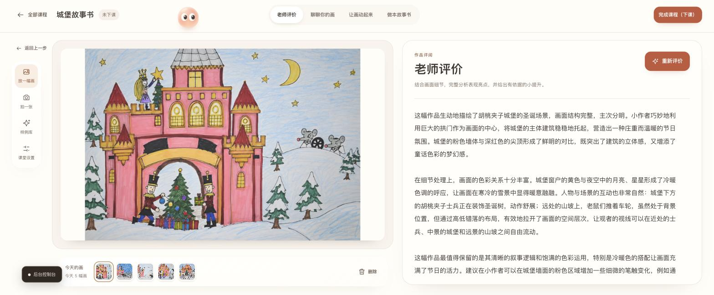

**让画动起来**：一幅画可以分别做成动作视频和立体小雕塑；做好的随时再看，也可以重新制作。

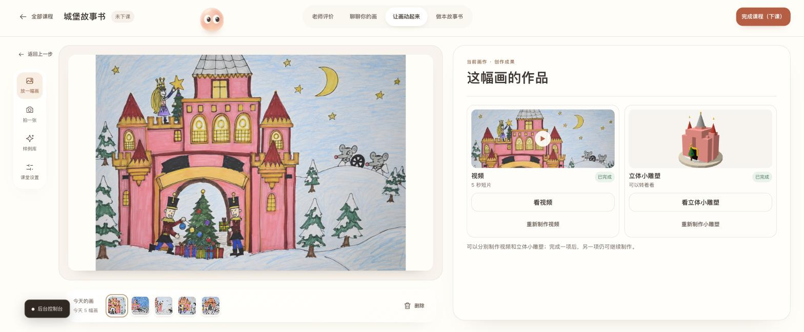

**让画动起来 · 动作视频**：约 5 秒的动画，可以导出带走。

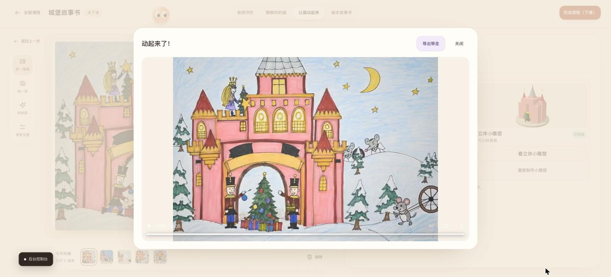

**让画动起来 · 立体小雕塑**：受这幅画启发的 3D 小玩偶，和原画并排；用简单的形状搭出来，给孩子看之前检查过，拖动就能转着看。

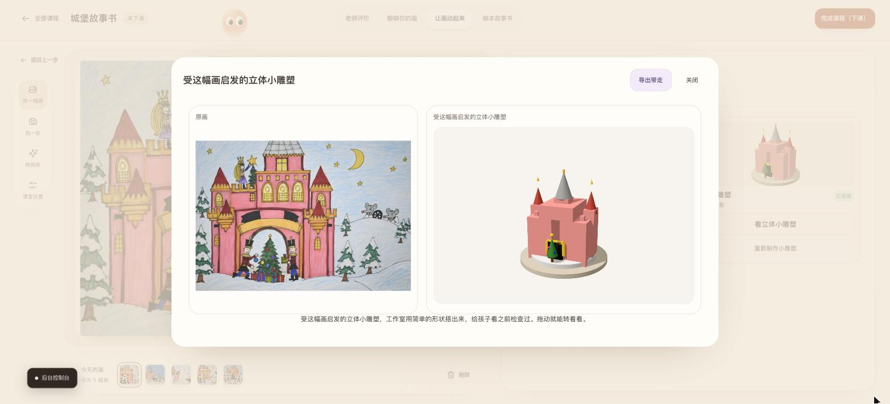

**做本故事书**：两到八幅画装订成书，这一本用黏土风格重绘；翻页朗读，可以用孩子自己的声音。

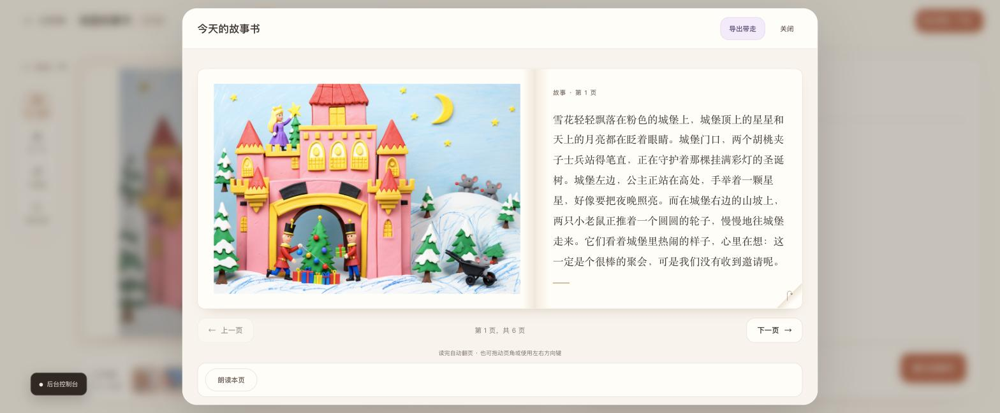

**下课以后 · 画作集**：下课后，这堂课的全部作品收进画作集，随时查看原图，也可以重新打开课程接着上。

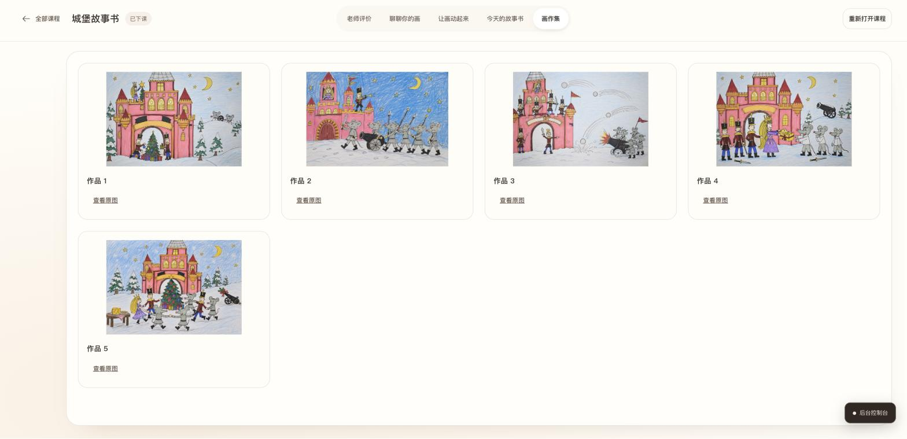

### 素描课堂

素描课堂有自己的三个模块：老师评价、聊聊你的画和形体与光影。彩画不纠正；素描要帮孩子看懂形体、比例和光影。

**素描 · 老师评价**：从形体、明暗交界线和投影评价一幅苹果和梨的静物素描，并给出下一次可以练习的地方。


**素描 · 聊聊你的画**：先肯定画得准的地方，再问孩子是怎么画出来的，并给一个可以马上试试的画法。


**素描 · 形体与光影**：把素描立成 3D 形体（这一幅由 TRELLIS.2 生成），拖动光源就能看明暗怎样变化，也可以转到和原画一样的角度对照。

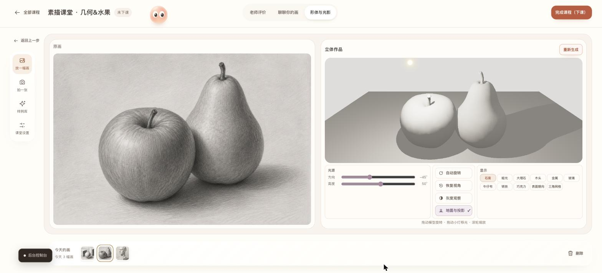

**StepFun Agentic Skills 展示 · 大殿篇**：Step 3.7 Flash 驱动六个 Agent Skill，一键演示盖起来、转一圈、拆开来、看载荷和
松开手，左侧是每一步的工具调用，右侧是可以拖动的 3D 大殿。

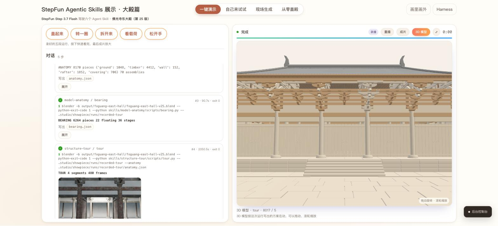

**从零盖殿**：回放 Agent 从空文件把大殿一件件盖起来的全过程：145 步的时间线、Harness 的检查循环和每一步的思考。


## 快速开始

### 环境要求

| | 开发与测试 | 运行课堂 |
|---|---|---|
| 机器 | macOS 或 Linux | NVIDIA DGX Spark（GB10，128 GB 统一内存） |
| 软件 | Python 3.13 与 [uv](https://docs.astral.sh/uv/)；Node.js（运行页面检查） | 另需 Docker 与 NVIDIA 容器运行时；模型权重另行下载，不随本仓库分发 |
| 密钥 | 跑测试不需要 | 至少一个 StepFun API Key（见下） |

### 安装

```bash
git clone https://github.com/FelixZhang1020/beyond-canvas.git
cd beyond-canvas
uv sync                                               # 一次即可：Python 3.13 和项目依赖装进 .venv
```

### 填写你自己的 API Key

**不想配置任何密钥**：直接用我们 DGX Spark 上正在运行的课堂，地址和课堂密码随参赛材料一起提交，不在本仓库里。
**想自己运行**：请使用你自己的密钥。本仓库里没有我们的任何密钥；你的密钥写在 `.env` 里，git 会忽略这个文件，不会被
误提交。

| 密钥 | 用途 | 必需 | 申请 |
|---|---|---|---|
| `STEPFUN_API_KEY` | 声音、听写、读草图、3D 小玩偶 | **是** | [platform.stepfun.com](https://platform.stepfun.com) |
| `DASHSCOPE_API_KEY` | 在线动画 Wan 3.0（画会发给阿里云） | 否：没有时用 Spark 上的 Wan 2.2 | 阿里云百炼（DashScope） |
| `OPENROUTER_API_KEY` | 只用于 `cloud`、`local` 评测配置 | 否 | [openrouter.ai](https://openrouter.ai/keys) |

StepFun 的密钥只在 `api.stepfun.com` 上有效；`api.stepfun.ai` 会把它当成错误的密钥拒绝。

```bash
cp .env.example .env                                  # 在项目目录里，在运行工作室的那台机器上
# 打开 .env，把你的密钥粘贴在 STEPFUN_API_KEY= 后面（想用在线动画，再填 DASHSCOPE_API_KEY=）
```

在 DGX Spark 上，`.env` 放在 Spark 上的项目目录里：`deploy/spark/start.sh` 从那里启动工作室。
[`.env.example`](.env.example) 在每个密钥的空行旁边也写了同样的说明。

### 检查与运行

```bash
.venv/bin/python -m studio.start --check              # 列出还缺哪个密钥，以及每个部件的状态（只读）
.venv/bin/python -m studio.start                      # 开一堂课；保持它运行，页面才能用
```

课堂需要的模型服务运行在 DGX Spark 上；在一台没有这些服务的机器上，`--check` 会逐项说明哪些部件还不可用。

## 在 DGX Spark 上部署

完整的中文部署与运行说明在 [部署指南](docs/guides/deployment-versions.md)，包括要开哪些账号、孩子的画和声音会去哪里。
第一次在一台 Spark 上部署，大致顺序是：

```bash
sh deploy/spark/sync.sh                               # 开发机：把代码送到 Spark
sh ~/beyond-canvas/deploy/spark/bootstrap.sh          # Spark：用户级的 Python 3.13 和依赖，不改动系统
tmux new -d -s downloads "sh ~/beyond-canvas/deploy/spark/download-models.sh"   # Spark：从 ModelScope 下载模型权重
sh ~/beyond-canvas/deploy/spark/build-blender.sh      # Spark：构建容器（另有 build-3d.sh、build-voice.sh、build-ffmpeg.sh）
sh ~/beyond-canvas/deploy/spark/door-setup.sh         # Spark：只做一次，生成证书和课堂密码
sh ~/beyond-canvas/deploy/spark/start.sh              # Spark：启动还没运行的服务（不要在上课时运行）
uv run python -m studio.ops.dayzero                   # 检查这台机器；加 --full 会加载模型并计时
```

开发机上的脚本默认连接我们的 Spark；连接你自己的，设置 `BEYOND_CANVAS_SPARK=用户@地址`，必要时再设置
`BEYOND_CANVAS_SPARK_PORT`（SSH 端口）和 `BEYOND_CANVAS_SPARK_KEY`（SSH 私钥路径）。

### 常用命令

```bash
sh deploy/spark/sync.sh                               # 送代码到 Spark，并把 Spark 上的课程档案取回一份
sh deploy/spark/compare-with-spark.sh                 # 只读：Spark 上的代码与本机是否一致，上课时也可以放心运行
sh deploy/spark/restart.sh studio                     # 重启指定的服务；有动画或 3D 任务在跑时会拒绝
sh deploy/spark/test-on-spark.sh                      # 在 Spark 上跑全部测试；后面跟一条命令则只跑那一条
sh deploy/spark/tunnel.sh                             # 开发用：在本机 localhost:7070 打开同一个课堂
```

从一个落后于 `main` 的代码副本发送会被拒绝，并列出它会把哪些提交从 Spark 上撤回。课堂页面通过 Spark 的公网入口提供，
前面只有一个课堂密码；密码在 Spark 上生成，从不提交到仓库。

### Spark 系统监控

```bash
python3 ~/beyond-canvas/deploy/spark/dashboard.py          # 在 Spark 上：实时画面，每 3 秒刷新，Ctrl+C 退出
python3 ~/beyond-canvas/deploy/spark/dashboard.py --once   # 在 Spark 上：只看一眼
ssh -t 用户@Spark地址 python3 beyond-canvas/deploy/spark/dashboard.py   # 从开发机远程查看
```

它用平实的话显示这台 Spark 此刻在做什么：显卡负载、内存（剩余不到 24 GB 的安全线时标红提示）、温度、功耗、网络和磁盘；
正在运行的服务和它们各占多少内存；最近完成的任务和今天的汇总；以及最近一小时每分钟一格的走势。它只读，不改动任何东西。
历史数据来自 `start.sh` 启动的记录器（`deploy/spark/spark_recorder.py`，在 `~/monitor` 里每天一个文件，保留 7 天）。
课堂页面控制台里的任务列表读的是同一份代码（`deploy/spark/dashboard_jobs.py`），所以两个画面说的是同一件事。

## 设计思路

**模型是发动机，Skill 是挡位，Harness 是整车。** Skill 是一个文件夹，没有被选中时什么也不做。Harness 是车的其余部分：
选挡的变速箱、拦住坏结果的刹车，还有仪表——仪表读的是工具写下的文件，而不是司机自己说发生了什么。
**装上发动机、自己开起来的整车，就是 Agent。**

这个作品有十三个挡位、一辆车和两种开法，只有其中一种在这里被称为 Agent。这个区别是有意的。

| | 课堂 | Agentic 3D（大殿） |
|---|---|---|
| 谁决定下一步 | Harness，按固定顺序 | 模型，每一轮自己决定 |
| Skills | 6 个：`studio-safety` `art-feedback` `painting-to-animation` `painting-to-figure` `sketch-to-3d` `drawings-to-storybook` | 7 个：`model-anatomy` `shot-judge` `joint-reveal` `structure-tour` `raise-the-hall` `load-path` `hall-carpenter` |
| 模型做什么 | 每一步之内判断：画里有什么、说什么、能不能给孩子看 | 测量原殿、放置构件、运行检查、修复 |
| 什么拦住坏结果 | 进出都过 `studio-safety`；每句回复都过质量关 | 七项交付检查：六项读工具写下的文件，一项由另一次模型调用看图 |

课堂之所以不称为 Agent，是因为它的路线是固定的。大殿重建是 Agent：在第四次重建、也是第一次在完整的交付关下进行的重建
里，Step 3.7 Flash 从空文件重建了大殿，在第 6 轮（共 6 轮）修复后被接收，用掉了 80 步额度中的 71 步
（[证据](docs/measured/rebuild-under-the-stricter-gate.md)）。这座殿是五台山佛光寺东大殿。

## 部署分工

唯一的部署方案是 StepFun First（`studio/profiles/stepfun.yaml`）。所有在对话里思考的模型都运行在 DGX Spark 上：
开放权重的 Qwen3.6 看每一幅画、写课堂上的每一句话，并按教学规则逐句检查，思考关闭——因为
Step 3.7 Flash 无法关闭思考，一句检查过的回复要 40 到 80 秒。3D、故事书的模型和 NVIDIA 的两个模型也在 Spark 上。
Step 3.7 Flash 和 StepAudio 2.5 通过 StepFun 的订阅调用：Step 3.7 Flash 读几何草图、设计 3D 小玩偶；StepAudio 2.5 是
工作室的声音，并听写孩子的录音。工作室每幅画最多保留一段录音，留在 Spark 上，用于故事书的朗读（见上文）。存档里的
大殿重建，以及展厅里的实时运行和它们的看图检查，都由 StepFun 上的 Step 3.7 Flash 驱动，在 Spark 上用 Blender 搭建。
动画有两个来源。Spark 上的 Wan 2.2 属于本地部署：5 秒约 18 分钟，已实测并搭好，任何没有设置 DashScope 密钥的副本都用
它。在我们多个课堂共用的这台 Spark 上，一段动画要占用约 72 GB 内存 18 分钟，所以老师看到它是灰色的，
课堂改用阿里云 DashScope 上的 Wan 3.0 在约 2 分钟内生成 5 秒动画。这会把画发给阿里云，页面上写明，这也是这里唯一
没有可下载权重的模型。

| 部分 | 在哪里运行 | 模型 |
|---|---|---|
| 页面、Harness、课程档案 | DGX Spark | — |
| 看画、反馈、聊天、规则检查、老师评价 | DGX Spark，NVIDIA vLLM 容器，思考关闭，一句 2–8 秒 | Qwen3.6-35B-A3B（NVIDIA 的 NVFP4 版本） |
| 素描 3D 形体 | 几何素描：Step 3.7 Flash 读形状，Spark 处理器搭建；其余在 Spark 上 | TRELLIS.2 |
| 短动画 | 本地部署：Spark，5 秒约 18 分钟；我们的课堂：阿里云，约 2 分钟 | Wan 2.2 I2V A14B；`wan3.0-video` |
| 彩画 3D 小玩偶 | StepFun 写零件、另一次调用复查，浏览器里绘制 | `step-3.7-flash` |
| 故事书绘本页 | DGX Spark，七种风格，约 5 秒一页 | FLUX.2 Klein 4B |
| 故事书朗读 | DGX Spark，孩子自己的声音（打字的回答用工作室的声音） | VoxCPM2 |
| 语音与听写 | StepFun 订阅 | `stepaudio-2.5-tts`、`stepaudio-2.5-asr` |
| 第二道安全检查 | DGX Spark，进出各看一次，0.4 秒 | NVIDIA Nemotron 3.5 Content Safety（4B） |
| 大殿工程师评审 | DGX Spark，NVIDIA vLLM 容器，按需调用 | NVIDIA Nemotron 3 Nano 30B A3B（NVFP4） |
| 大殿重建与渲染 | DGX Spark 容器：处理器搭建，NVIDIA 芯片渲染 | Blender 5.0.1（Ubuntu 的 Arm 版） |

Skill 从不点名厂商。它调用一个有名字的槽位（`vlm.studio`、`video.animation`、`mesh.portrait` 等），由配置文件把槽位
解析到具体的服务，所以把一项任务在 Spark 和托管服务之间挪动，只需改 YAML 里的一行。`studio/profiles/spark.yaml` 是
让每个槽位都在这台机器上运行的计划，标注为未验证，并记录了完整的 Step 3.7 Flash 放不进一堂课的旁边；它的内存算术由
`tests/ops/test_dayzero.py` 守住。

## 多智能体协同与模型编排

十个模型和三件制作工具完成这些工作，没有一个 Skill 点名它们：Skill 调用槽位，一个配置文件决定由谁来回答，所以把一项
任务在 Spark 和托管服务之间挪动只是一行改动。每个模型只做它最擅长的那件事。课堂里由同一个模型 Qwen3.6 写回复、也
判断回复；判断是另一次调用，带着自己的指令，而且代码会拒绝任何没有引用回复原话的异议。

| 模型 · 在哪里 | 负责 | 给它什么 | 绝不做 |
|---|---|---|---|
| **Qwen3.6-35B-A3B** · Spark | 看画、写课堂上的话、逐条按规则判断 | 画、对话、每次一条规则 | 检查通过前显示回复；用回复里没有的话提异议 |
| **Step 3.7 Flash** · StepFun | 读草图、设计小玩偶、大殿 Agent 选 Skill | 画、Skill 的名字和描述、工具写下的文件 | 给自己的工作判通过 |
| **Nemotron 3.5 Content Safety** · Spark | 0.4 秒的安全判断 | 进门的画，出门的图和动画 | 自己不可用时拦住一堂课（账本记下缺了这一眼） |
| **Nemotron 3 Nano 30B** · Spark | 已交付大殿的结构评审 | 交付后的大殿，按需调用 | 接触进行中的重建（最初 11 条意见有 8 条读错图纸） |
| **TRELLIS.2 · Wan 2.2 · FLUX.2 Klein 4B** · Spark | 3D 形体、本地动画、绘本页 | 筛查过的画和实测设置；绘本页另有必须保留的清单 | 在 `studio-safety` 看过之前展示任何东西 |
| **Wan 3.0** · 阿里云 | 课堂的 5 秒动画，约 2 分钟 | 筛查过的画 | 页面没写明画会发给阿里云时被使用 |
| **VoxCPM2** · Spark | 用孩子的声音读书 | 第一次开口的回答（≤10 秒）和听到的字 | 把声音送出 Spark（录音只随课程档案的备份存在） |
| **Blender 5** · Spark | 测量原殿、搭建新殿 | 模型文件和工具参数 | 报告自己的结果：检查读它写下的文件 |
| **StepAudio 2.5** · StepFun | 工作室的声音、听写 | 要念的文字、要听写的录音 | 保留录音 |

三条规则把编排连在一起：

- **模型说的话从来不是结果。** 大殿七项检查里有六项的结论读自工具写下的文件；3D 小玩偶要两次独立查看都通过才展示；
  回复必须过质量关才能到老师面前。
- **能胜任的最小模型接活。** 守住每一幅画的是一个 0.4 秒的 4B 安全模型，而不是再问一次大模型。
- **谁在哪里运行只是一行配置。** 整个工作室就是这样在一天之内搬上 DGX Spark 的，也是课堂需要内存时，把一项任务挪下
  这台机器的办法。

说得直白些：这是一辆带着检查员的车，而不是一支车队。模型轮流工作，从不并行争论；课堂的路线是有意固定的——面对孩子，
可预期比自主更重要。

## 模型优化深度

以下都在 GB10 上实测，不取自模型卡。Spark 可用内存约 119 GiB，内存耗尽时它会直接卡住而不是报错，所以下面每一项改动
都同时看内存和时间。这里的模型优化，指的是让模型在这一台机器上跑好：怎样加载、在内存里留多久、各自能用多少内存、
一项任务能花多少思考。

| 项目 | 之前 | 之后 | 做法 | 证据 |
|---|---|---|---|---|
| 检查过的聊天回复 | 40–80 秒 | **2–8 秒** | 判断改用关闭思考的 Qwen3.6；异议必须引用原话，判对从 4/7 升到 17/21 | [实测](docs/measured/qwen-judges-the-class.md) |
| Wan 2.2 动画（3 秒） | 约 31 分钟（估计） | **711 秒** | 49 帧、16 fps、15 步，从实测设置表中选出 | [实测](docs/measured/faster-jobs-on-the-spark.md) |
| Wan 2.2 动画加长 | 3 秒 | **5 秒，1,082 秒** | 计时 3、5、7、10 秒后选 5 秒 | [实测](docs/measured/clip-length-trial.md) |
| TRELLIS.2 常驻 | 约 205 秒 | **约 69 秒** | 常驻进程把模型留在内存里 | [实测](docs/measured/trellis-stays-loaded.md) |
| TRELLIS.2 排队 | 排在图片任务后卡住 | **243 秒** | 关掉低内存模式（多用约 4 GiB） | [证据](docs/measured/trellis-hang-on-spark.md) |
| FLUX 绘本页（4 页） | 40 秒 | **19.4 秒** | 一本书的任务之间保持加载 | [实测](docs/measured/storybook-styles.md) |
| FLUX 姿势图加载¹ | 253 秒 | **约 20 秒** | 权重整份读入，不用内存映射 | [`fast_load.py`](deploy/spark/fast_load.py) |
| FLUX 姿势图常驻¹ | 约 27 秒 | **5.6 → 3.1 秒** | 任务之间保持加载 | [实测](docs/measured/faster-jobs-on-the-spark.md) |
| Blender 渲染 48 帧 | 1,498 秒（处理器） | **79 秒**（NVIDIA 芯片） | 改用芯片渲染，约占四分之一芯片、2.4 GiB | [`bin/blender`](deploy/spark/bin/blender) |
| 每项 GPU 任务 | 内存耗尽会卡死 | **24 GiB 安全线** | 实测内存放得下才开始，共用一把 GPU 锁 | [`memory_guard.py`](deploy/spark/memory_guard.py) |
| Qwen3.6 常驻 | 0.28 的内存份额起不来 | **固定 0.38（约 46 GB）**，写一句 0.6–1 秒（检查另计） | NVIDIA vLLM 容器 + NVIDIA 的 NVFP4 权重（22.4 GB） | [实测](docs/measured/chat-speed-and-front-voice.md) |
| Nemotron 3 Nano 评审 | vLLM 默认占 90% 内存 | **固定 28%**，44–96 秒一次 | NVIDIA vLLM 容器 + NVFP4 权重 | [证据](docs/measured/engineers-review-first-run.md) |
| Nemotron 安全检查 | 自写规则，约 5 秒 | **标准规则，0.4 秒** | 同七幅画实测后保留 NVIDIA 标准规则 | [证据](docs/measured/nemotron-safety-on-spark.md) |
| 更大的图片模型？ | FLUX.2 Klein 9B：46–63 秒，约 35 GiB | **保留 4B** | 三幅测试画上没有明显提升 | [实测](docs/measured/faster-jobs-on-the-spark.md) |
| Step 3.7 Flash | 小 token 预算时回答为空 | **按任务设思考强度和 token 下限** | 它隐藏的思考按输出计费 | [`stepfun.yaml`](studio/profiles/stepfun.yaml) |

¹ 姿势图已停用：动画成为「让画动起来」唯一的输出。Blender 改用芯片后，整套测试也从约 16 分钟降到约 4 分半。

**NVIDIA 的推理栈怎么用。** 课堂的主模型 Qwen3.6-35B-A3B 和大殿评审 Nemotron 3 Nano 都用 NVIDIA 发布的 NVFP4 权重，
在 NGC 的 vLLM 容器（`nvcr.io/nvidia/vllm:26.08-py3`）里运行。选它，是因为这台共用的 Spark 有两个硬要求：直接读取
NVFP4 权重；给每个模型划定固定的内存份额（Qwen 0.38、Nemotron 0.28），因为这台机器内存耗尽时会直接卡住。
TensorRT-LLM 和 NIM 没有在这台机器上实测，所以这里不说它们更快或更慢。NVIDIA 的其他候选也在这台 Spark 上实测过：
Nemotron Nano 12B v2 VL（看画聊天）、Cosmos3 Edge（动画）、Nemotron 3.5 ASR 与 Magpie TTS（听写与声音），
结果和取舍见[实测记录](docs/measured/chat-speed-and-front-voice.md)。

## Agent Skills 设计

[`skills/`](skills/) 里的十三个文件夹都遵循 NVIDIA 的发布格式：`SKILL.md`（做什么、什么时候用）、`skill-card.md`、
`evals/evals.json`、`BENCHMARK.md`，以及 `skill.oms.sig`——覆盖文件夹里每一个发布文件的 OpenSSF Model Signing 签名。
公钥是 [`skills/beyond-canvas-skills.pub`](skills/beyond-canvas-skills.pub)，任何人都可以校验这些文件夹：

```bash
uv run python -m evalkit.signing verify skills
```

| Skill | 做什么 |
|---|---|
| `studio-safety` | 工作室处理一幅画之前先筛查它；做出的图和动画在任何人看到之前也要筛查 |
| `art-feedback` | 对孩子的画写出温暖、具体的反馈，外加一个请老师转问的问题 |
| `painting-to-animation` | 用一幅画生成一段短动画，保留原画，动画要经过筛查 |
| `painting-to-figure` | 把一幅彩画做成一个 3D 小玩偶，检查没通过就不展示 |
| `sketch-to-3d` | 把桌面素描写生立成可以移动灯光的 3D 形体 |
| `drawings-to-storybook` | 把两到八幅画装订成书，用孩子亲口确认的话：用原画，或把每一页重绘成一种绘本风格，并用孩子自己的声音朗读 |
| `model-anatomy` | 一座 3D 建筑的每一个构件：它的作用、尺寸，以及它压在什么上面 |
| `shot-judge` | 一张渲染出的画面有没有拍出它该拍的东西 |
| `joint-reveal` | 把一组斗拱拆开，展示榫卯怎样咬合 |
| `structure-tour` | 绕着建筑、走进建筑、飞越建筑的镜头导览 |
| `raise-the-hall` | 按真实的承重顺序，从台基一直搭到屋顶 |
| `load-path` | 重量往哪里走，以及重力和地震测试 |
| `hall-carpenter` | 从零搭出一座木构大殿，和现存的那座对得上 |

贯穿它们的三条设计规则：

- **这个 Skill 值得存在吗？** 每个 benchmark 都用同样的用例分别跑“带 Skill”和“只用模型”。通过 StepFun 用
  Step 3.7 Flash 实测 10 个用例：带 Skill 时 `art-feedback` 的回复满足了 95% 的适用教学规则，不带时是 61%
  （[benchmark](skills/art-feedback/BENCHMARK.md)）。在六个 3D 用例上，带 Skills 有 4 个得出了答案，不带时 2 个；修复
  之后，两个碰到步数上限的用例重跑并得出了答案（[证据](docs/measured/showpiece-benchmark-first.md)）。
- **模型只看描述就能选对吗？** `evalkit/dispatch.py` 只给模型看各个 Skill 的名字和描述，问它每个评测用例该交给哪个
  Skill。这正是大殿搭建者每一轮要做的选择，描述相同，只是可选的 Skill 更少：展厅里六个，一次重建里四个。
  在 `painting-to-figure` 加入之前的十二个 Skill 中，Step 3.7 Flash 51 次选对 43 次。八次失误里有五次是真的：两次对白纸
  的反馈请求和一幅彩画被交给了 `studio-safety` 而不是 `art-feedback`，另有两对大殿 Skill 被互相认错；两次是答案乱码；
  还有一次是按一个与 Skill 自身描述相矛盾的测试标签计分的（[证据](docs/measured/skill-picking.md)）。
- **检查靠测量，不靠问。** 工具的结论从它写下的文件里读。唯一一个请模型看图的检查（`shot-judge`）保留了下来，并被记为
  最弱的一环。

## 技术栈

- **NVIDIA：** DGX Spark（GB10，128 GB 统一内存）；NGC 容器 `nvcr.io/nvidia/pytorch:26.08-py3`（媒体镜像的基础）、
  `nvcr.io/nvidia/vllm:26.08-py3` 和 `nvcr.io/nvidia/cuda:13.0.0-base-ubuntu24.04`；Nemotron 3.5 Content Safety；
  Nemotron 3 Nano 30B A3B（NVFP4）；NVIDIA 发布的 Qwen3.6-35B-A3B NVFP4 权重；NVIDIA 的 Agent Skills 格式，
  以及它的 `nemotron-policy-generator` Skill——我们用它写出儿童工作室的安全规则，作为 NVIDIA 标准规则之外经过
  实测的备用规则保留。
- **阶跃星辰 StepFun：** Step 3.7 Flash（`step-3.7-flash`）、StepAudio 2.5 TTS（`stepaudio-2.5-tts`）和 ASR
  （`stepaudio-2.5-asr`），通过 Step Plan 订阅调用。
- **Spark 上的开放模型：** Qwen3.6-35B-A3B、TRELLIS.2、Wan 2.2 I2V A14B、FLUX.2 Klein 4B、VoxCPM2。
- **唯一没有可下载权重的模型：** 阿里云 DashScope 上的 Wan 3.0（`wan3.0-video`），生成我们课堂的动画；没有设置
  DashScope 密钥的地方，改由 Spark 上的 Wan 2.2 生成。
- **软件：** Python 3.13 与 uv、PyTorch、diffusers、Transformers、safetensors、vLLM、Docker、Blender 5、
  three.js、页面用原生 JavaScript（不打包）、OpenSSF Model Signing。

## 测试

```bash
.venv/bin/python -m pytest                            # Python 测试（会花钱的在线测试默认不跑）
node --test "tests/page/*.test.mjs"                   # 页面检查
sh studio/page/build.sh                               # 从 studio/page/src/ 重新生成 studio/page/index.html
uv run python -m evalkit.signing verify skills        # 校验 13 个 Skill 的签名
```

测试不需要自己的密钥：会用密钥花钱的测试都标为 live，默认不跑。我们自己的做法是所有测试都在 Spark 上跑：
`sh deploy/spark/test-on-spark.sh`（全部），或 `sh deploy/spark/test-on-spark.sh python -m pytest tests/server`（只跑一部分）。

## 项目结构

```
studio/                 工作室本身：`python -m studio.start` 开一堂课
  start.py serve.py     怎样启动，以及页面和它的路由
  classroom/            一堂课：它的画、老师的请求、课程档案
  conversation/         一幅画的对话：开场、回复、每一句回复都要过的检查
  making/               用一幅画做出的东西：动画、3D 形体、小玩偶、故事书的页面
  voice/                对课堂说话、听孩子说话、故事书里孩子的声音
  server/               课堂密码门、实时更新、页面的其他路由
  core/                 分阶段执行请求、账本、槽位与配置、费用、内存保护
  ops/                  给运维这台机器的人用的就绪检查和模型状态工具
  providers/ profiles/  每个槽位由谁来回答，以及写明这一点的配置文件
  page/                 老师的页面（原生 JavaScript，构建成一个文件）
  showpiece/            Agentic 3D：大殿重建、它的仪表盘和 Harness 页面
skills/                 十三个 Agent Skills，每个都有签名
evalkit/                十四条教学规则、判断、benchmark、打包与签名检查
tests/                  与 studio/ 相同的分区，另有 providers/ evalkit/ skills/ deploy/ page/
deploy/                 spark/（DGX Spark）、gpu-media/ 和 trellis2/（它的模型服务）、archive/
docs/                   specs/ guides/ design/ measured/ screenshots/ ten-day-talk/，总目录是 docs/README.md
tools/                  小型 benchmark 和一次性的构建工具
```

## 文档索引

| 文档 | 说明什么 |
|---|---|
| [docs/README.md](docs/README.md) | 所有文档的总目录，按你想知道的事情排列 |
| [docs/specs/art-studio-skill-pack-design.md](docs/specs/art-studio-skill-pack-design.md) | 权威的设计记录 |
| [docs/guides/deployment-versions.md](docs/guides/deployment-versions.md) | 部署实际运行什么，中文，写给要把它搭起来的人 |
| [studio/page/README.md](studio/page/README.md) | 老师的页面：构建、测试、运行 |
| [docs/design/DESIGN-PRINCIPLES.md](docs/design/DESIGN-PRINCIPLES.md) | 界面规则 |
| [docs/measured/](docs/measured/) | 证据。关于模型表现的说法，如果这里没有对应的文件，就只是计划，不是结果 |

## 数据与隐私

- **不在本仓库里：** 课堂的示例画、密钥（`.env`）和工作室的本地状态（`.studio/`：课程档案、账本、日志）
  从不提交。课程档案和示例画保存在开发机和运行课堂的 Spark 上；
  [部署指南](docs/guides/deployment-versions.md) 说明了每一类数据去哪里。
- **孩子的录音：** 每幅画最多保留一段（孩子第一次开口的回答，最多 10 秒），留在 Spark 上供故事书朗读；撤回回答、清空聊天、
  删除这幅画或这堂课时一并删除，但 Spark 最近 7 份每日备份和开发机上的副本要等它们被替换或清除。听写会把录音发给
  阶跃星辰。工作室不建立儿童身份档案。
- **关于 AI 生成的内容：** `skills/*/evals/files/` 里的评测用画由程序或图像模型生成；入口插图怎样生成写在
  [它们的 README](studio/page/assets/entrance/README.md) 里；`studio/voice_lab/voices/` 里的声音是合成的。工作室用孩子的画
  做出的每一张图、每一段动画、每一个 3D 形体和每一个声音都是 AI 生成的。代码和文档在 AI 协助下编写。

## 参与贡献

欢迎提交 Issue 和 Pull Request。[CONTRIBUTING.md](CONTRIBUTING.md) 说明了怎样搭建环境、运行检查和提出改动，保护孩子的
规则排在最前面。请遵守[行为准则](CODE_OF_CONDUCT.md)；安全问题，或任何可能泄露孩子数据的问题，请按
[SECURITY.md](SECURITY.md) 的方式私下报告。改动记录在 [CHANGELOG.md](CHANGELOG.md) 里。

## 许可证

本项目以 [Apache License 2.0](LICENSE) 发布，另见 [NOTICE](NOTICE)。它调用的模型不包含在本仓库里，各自适用自己的许可证
（见下一节）。

## 第三方组件与素材

本仓库不分发任何模型权重。下表列出工作室用到的主要模型、软件和素材；许可证以各自的官方说明为准，表中的记录只作索引。

| 组件 | 用途 | 许可证 |
|---|---|---|
| TRELLIS.2（Microsoft） | 3D 形体 | 代码和主要权重 MIT；依赖的 DINOv3、RMBG-2.0（非商用）、nvdiffrast / nvdiffrec（非商用研究）另有限制，见 [LICENSES.md](deploy/trellis2/LICENSES.md) |
| Wan 2.2 I2V A14B | 本地部署的动画 | Apache 2.0 |
| FLUX.2 Klein 4B（Black Forest Labs） | 故事书绘本页 | Apache 2.0 |
| VoxCPM2（OpenBMB） | 用孩子的声音读书 | Apache 2.0 |
| Qwen3.6-35B-A3B | 看画、写话、逐句检查 | 以官方模型卡为准（本仓库未记录） |
| NVIDIA Nemotron 3.5 Content Safety、Nemotron 3 Nano | 安全检查、大殿评审 | 以 NVIDIA 官方模型卡为准（本仓库未记录） |
| Step 3.7 Flash、StepAudio 2.5 | 读草图、小玩偶、大殿 Agent、语音与听写 | StepFun API，适用其服务条款 |
| Wan 3.0 | 课堂的在线动画 | 阿里云 DashScope API，适用其服务条款 |
| NVIDIA NGC 容器（PyTorch、vLLM、CUDA） | 媒体与模型服务的基础镜像 | NVIDIA Deep Learning Container License |
| Blender 5.0.1 | 大殿的测量、搭建与渲染 | GNU GPL；在容器里运行，不随本仓库分发 |
| vLLM（NVIDIA NGC 容器） | 在 Spark 上运行 Qwen3.6、Nemotron 3 Nano | Apache 2.0 |
| three.js | 页面里的 3D 查看器 | MIT（随附 LICENSE） |
| 佛光寺东大殿照片 | 大殿篇的参考照片 | CC BY-SA 4.0，Patrick20242023 摄（Wikimedia Commons），裁切缩放后同许可共享，见 [CREDITS.md](evalkit/briefs/foguang-east-hall/CREDITS.md) |

## 致谢

感谢 NVIDIA 提供 DGX Spark 和这场黑客松，感谢阶跃星辰 StepFun 提供模型与订阅，感谢以上开放模型和开源软件的作者，
感谢在 Wikimedia Commons 上分享佛光寺东大殿照片的 Patrick20242023。也感谢第一位在真实课堂里用它上课的老师。
